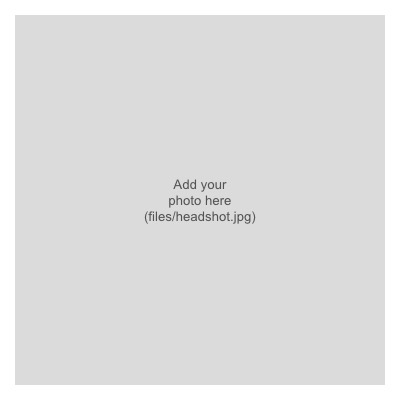

::: {layout="[65,35]"}

::: {}

# Your Name

**Your Title** (e.g. PhD Candidate) <br>
Your Department, Your University

I am a [your field, e.g. applied economist] working on [your main research areas].
I study [1–2 sentence description of your research agenda]. Before that, I
[brief background — prior degrees, positions].

My CV is available [here](cv.qmd), and you can reach me at
[you@example.com](mailto:you@example.com).

:::

{.profile-photo}

:::

## News

```{r}
#| echo: false
#| results: asis
cat("- **", format(Sys.Date(), "%Y"), "** - Add a recent update (paper accepted, talk given, award, etc.)\n", sep = "")
```

- Add another item here

